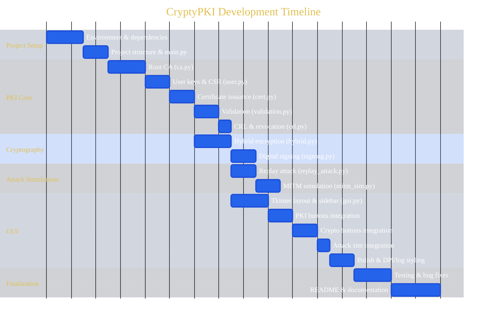

# CryptyPKI

**CryptyPKI** is a modern Python GUI application that demonstrates core Public Key Infrastructure (PKI) operations, hybrid encryption, digital signatures, and simulated cryptographic attacks.

---

## 🚀 Features

- Full PKI lifecycle: create CAs, issue, validate, and revoke certificates
- Hybrid file encryption using AES-256-GCM + RSA-OAEP
- Digital file signing and verification with RSA-PSS
- Built-in MITM and Replay Attack simulations
- Clean, modern Tkinter GUI with real-time activity log
- Replay protection via nonce tracking and timestamp validation

---

## 🏛 PKI Management

- Create a Root Certificate Authority (CA)
- Generate user key pairs and Certificate Signing Requests (CSRs)
- Issue end-user certificates
- Validate certificates
- Revoke certificates
- Maintain a lightweight Certificate Revocation List (CRL)

---

## 🔐 Cryptographic Operations

- Hybrid file encryption using:
  - AES-256-GCM (symmetric encryption)
  - RSA-OAEP (asymmetric key exchange)
- Secure file decryption
- Digital file signing using RSA-PSS
- Signature verification

---

## ⚠️ Security Attack Simulations

CryptyPKI includes built-in demonstrations of common cryptographic attack scenarios:

- **MITM (Man-in-the-Middle) Simulation**  
  Demonstrates the risks of unverified or spoofed certificates

- **Replay Attack Simulation**  
  Shows vulnerabilities that arise without replay protection mechanisms

---

## 🖥 GUI Interface


- Clean and modern Tkinter-based interface
- Sidebar navigation for:
  - PKI operations
  - Cryptographic tools
  - Attack simulations
- Real-time, color-coded activity log
- Secure dialogs for username and password input

---

## 🛠 Installation

### Prerequisites

- Python 3.8+
- pip

### Steps

```bash
# 1. Clone the repository
git clone https://github.com/yourusername/CryptyPKI.git
cd CryptyPKI

# 2. Install dependencies
pip install -r requirements.txt

# 3. Run the application
python main.py
```

---

## 📁 File Structure

```
CryptyPKI/
├── main.py                  # Entry point, initializes environment and launches GUI
├── gui.py                   # Tkinter GUI — layout, sidebar, activity log
├── requirements.txt
│
├── pki/
│   ├── ca.py                # Root CA creation and loading
│   ├── user.py              # User key pair and CSR generation
│   ├── certificate.py       # Certificate issuance
│   ├── validation.py        # Certificate validation
│   └── crl.py               # Certificate Revocation List
│
├── crypto/
│   ├── hybrid.py            # AES-256-GCM + RSA-OAEP encrypt/decrypt
│   └── signing.py           # RSA-PSS file signing and verification
│
├── attacks/
│   ├── mitm_simulation.py   # MITM attack demo
│   └── replay_attack.py     # Replay attack demo + nonce tracking
│
└── AppData/                 # Auto-generated at runtime
    ├── root_ca/             # CA key and certificate
    ├── users/               # User keys, CSRs, certificates
    └── crl/                 # Revocation list and used nonces
```

---

## 📅 Development Timeline



---

## ⚙️ Technologies Used

- Python
- Tkinter (GUI)
- Cryptography libraries (RSA, AES, PKI operations)

---

## 📌 Disclaimer

CryptyPKI is intended for educational and demonstration purposes only.  
It should not be used as a production-grade security system.
